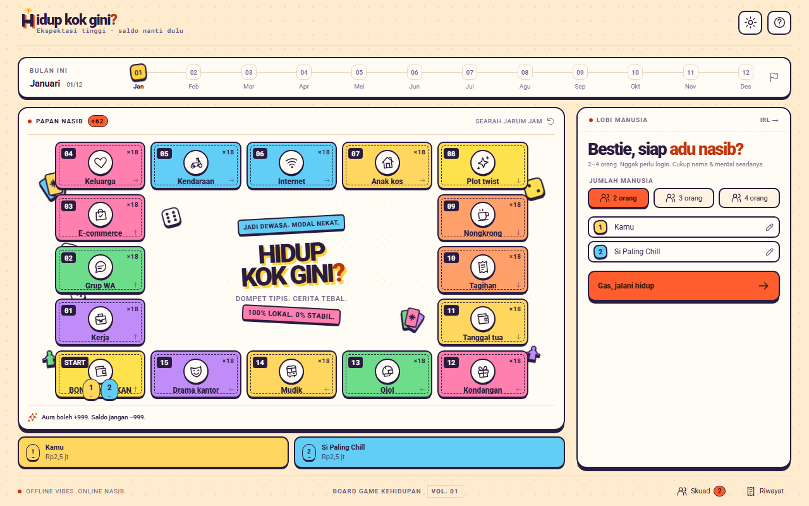
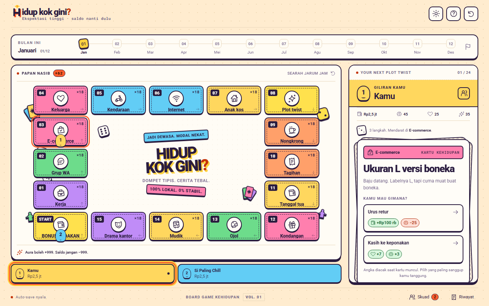
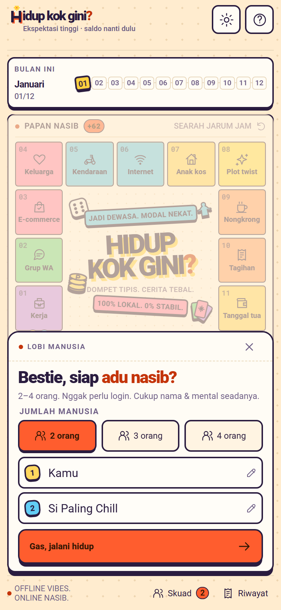
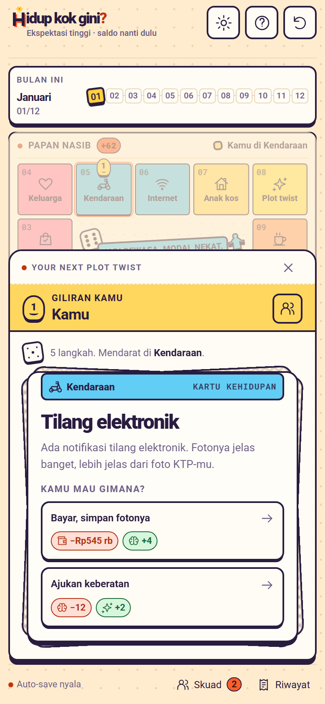

# Hidup Kok Gini?

Game papan digital lokal tentang bertahan hidup selama satu tahun sebagai warga Indonesia: gajian datang, tagihan ikut datang, grup WhatsApp nggak pernah tidur, dan keputusan kecil bisa berubah jadi utang atau krisis hidup.

`Hidup Kok Gini?` adalah proyek hobi independen untuk 2–4 pemain yang bermain bergantian di satu perangkat. Tidak ada akun, backend, transaksi uang sungguhan, iklan, atau layanan berbayar. Semua uang dan utang di dalam game bersifat virtual.

## Tampilan

<p align="center">
  
  
</p>
<p align="center">
  
  
</p>

## Inspirasi

Proyek ini terinspirasi oleh **[WNI Simulator](https://wnisimulator.hecticholic.com/)** karya Hecticholic, terutama gagasan menjadikan pengalaman sehari-hari orang Indonesia sebagai game papan satir. Situs resminya menggambarkan WNI Simulator sebagai board game satir yang terinspirasi situasi dan pengalaman sehari-hari orang Indonesia.

Ini bukan adaptasi resmi, edisi digital, port, atau produk yang berafiliasi dengan WNI Simulator maupun Hecticholic. Nama, logo, ilustrasi, antarmuka, kode, teks kartu, hasil pilihan, struktur papan, sistem statistik, dan implementasi aturan dalam repositori ini dibuat khusus untuk proyek ini. Jangan menambahkan hasil pindai, foto, logo, teks kartu, buku aturan, atau aset lain milik WNI Simulator ke repositori.

Kalau kamu menyukai premisnya, dukung pembuat aslinya melalui situs resmi WNI Simulator.

## Main online

Game ini tayang gratis di <https://hidup-kok-gini.pages.dev>. Setelah dibuka sekali, game bisa dimainkan tanpa internet dan bisa dipasang ke layar utama HP.

### Deploy ke Cloudflare Pages

Situs ini statis, jadi cukup hubungkan repositori GitHub di Workers & Pages → Create → Pages → Connect to Git:

| Pengaturan | Nilai |
|---|---|
| Nama proyek | `hidup-kok-gini` |
| Production branch | `master` |
| Build command | `npm run build` |
| Build output directory | `dist` |

Versi Node dikunci di `.node-version`. Header keamanan dan cache ada di `public/_headers`. URL kanonis di `index.html`, `public/robots.txt`, dan `public/sitemap.xml` memakai `https://hidup-kok-gini.pages.dev`; ganti ketiganya kalau nanti memakai domain sendiri.

## Mainkan secara lokal

Butuh Node.js 22.18 atau lebih baru dan npm.

```sh
npm install
npm run dev
```

Buka alamat yang ditampilkan Vite, biasanya <http://127.0.0.1:5173>. Semua pemain menggunakan perangkat yang sama.

Perintah lain:

```sh
npm run typecheck   # pemeriksaan TypeScript strict
npm test            # seluruh tes Vitest
npm run build       # typecheck dan build produksi ke dist/
npm run preview     # jalankan hasil build secara lokal
npm run tune        # simulasi grid untuk eksperimen keseimbangan
```

## Cara bermain

1. Pilih 2–4 pemain dan isi nama mereka.
2. Semua pemain mulai di GAJIAN dengan Dompet, Kewarasan, Relasi, Hoki, dan Hutang awal yang sama.
3. Setiap pemain mendapat satu giliran per bulan. Lempar dadu, gerakkan pion, lalu ambil kartu sesuai petak tujuan.
4. Pilih satu respons. Nilai efek sudah diacak saat kartu muncul, sehingga angka yang terlihat adalah angka yang akan dipakai.
5. Kalau Dompet tidak cukup untuk membayar pilihan atau tagihan, kekurangannya menjadi Hutang beserta biaya pinjaman. Dompet tidak berakhir di bawah Rp0.
6. Saat melewati GAJIAN, pemain menerima gaji, membayar biaya hidup dan tagihan, menjalankan efek status, lalu membayar bunga dan cicilan Hutang.
7. Kewarasan, Relasi, atau Hoki yang jatuh ke 0 memicu krisis. Status dan kondisi pemain dapat mengunci pilihan atau mengubah kartu yang ditarik.
8. Setelah semua pemain menyelesaikan giliran Desember, skor akhir menentukan peringkat.

```text
Score = floor((Dompet - Hutang) / 100,000)
        + Kewarasan + Relasi + Hoki
```

Skor yang sama berbagi peringkat yang sama, termasuk juara bersama.

## Sistem utama

- **168 kartu kategori** tentang kerja, keluarga, anak kos, kendaraan, nongkrong, belanja online, tagihan, tanggal tua, kondangan, grup WhatsApp, ojol, internet, mudik, dan drama kantor.
- **Hutang:** kekurangan uang otomatis dipinjam dengan biaya; pendapatan biasa tidak melunasinya secara otomatis.
- **Status:** pilihan dapat memberi atau menghapus status, status sementara kedaluwarsa saat bulan berganti, dan beberapa status memberi efek saat GAJIAN.
- **Krisis:** burnout mengalihkan semua tarikan ke kartu krisis; apes mengubah kartu Plot twist; utang besar dapat memicu kunjungan debt collector.
- **Pilihan bersyarat:** kondisi statistik dan status dapat membuka atau mengunci respons tertentu.
- **Deterministik:** seed, urutan aksi, dan data konten yang sama menghasilkan permainan yang sama.
- **Lokal dan privat:** permainan tidak mengirim data ke server. Progres hanya disimpan di `localStorage` browser.
- **Aksesibel:** mendukung keyboard, teks pembaca layar, tema terang/gelap, dan preferensi reduced motion.

## Penyimpanan dan replay

Game menyimpan seed, nama pemain, dan jurnal aksi berversi di `localStorage`. State dibangun kembali dengan memainkan ulang jurnal tersebut. Save saat ini menggunakan versi 5; save lama yang tidak kompatibel tidak dimigrasikan diam-diam.

Urutan pengambilan angka acak merupakan bagian dari format save. Perubahan pada urutan kartu, efek, atau aturan yang memengaruhi replay harus disertai kenaikan versi save dan pembaruan fingerprint konten.

## Struktur proyek

```text
src/
  components/              komponen React dan stylesheet per komponen
  data/
    content/               kartu, status, papan, ekonomi, pemain, dan ending
    parse/                 parser serta validasi data buatan tangan
  game/
    availability.ts        pilihan tersedia, berutang, atau terkunci
    debt.ts                pinjaman, bunga, dan cicilan
    deck.ts                pool kartu berdasarkan petak dan status
    reducer.ts             state machine giliran
    simulation.ts          simulasi keseimbangan dengan seed tetap
    statuses.ts            status, krisis otomatis, dan masa berlaku
    replay.ts              validasi dan replay jurnal save
  hooks/                   state UI, tema, setup, dan animasi giliran
scripts/                   utilitas scaling dan tuning keseimbangan
public/fonts/              Roboto dan Roboto Mono beserta lisensi OFL
docs/                      desain, panduan penulisan, spesifikasi, dan rencana
```

## Menambah konten

Kartu disimpan sebagai JSON di `src/data/content/cards/`. Baca [`docs/copy-guide.md`](docs/copy-guide.md) sebelum menulis. Gunakan ID unik dan stabil, 2–3 pilihan per kartu, serta bahasa Indonesia yang terasa natural.

Jangan menyalin materi dari game lain. Inspirasi boleh datang dari pengalaman hidup, genre, tema umum, atau mekanik abstrak, tetapi kalimat, lelucon, ilustrasi, nama kartu, susunan visual, dan aset harus dibuat sendiri.

Setelah mengubah konten atau aturan:

1. Jalankan `npm run typecheck`, `npm test`, dan `npm run build`.
2. Naikkan versi save jika perubahan mengubah replay lama.
3. Rekam ulang fingerprint hanya setelah memastikan perubahan memang disengaja.
4. Gunakan commit kecil dan mengikuti aturan di [`AGENTS.md`](AGENTS.md).

## Lisensi

Proyek hobi ini bersifat **open source** dan tersedia di bawah [MIT License](LICENSE). Kamu boleh menggunakan, menyalin, mengubah, dan mendistribusikan kode proyek sesuai ketentuan lisensi tersebut.

Roboto dan Roboto Mono tetap menggunakan SIL Open Font License 1.1; teks lisensinya tersedia di `public/fonts/`. Paket npm memiliki lisensi masing-masing.

Logo H pixel art dan matahari kecil dibuat khusus untuk proyek ini. Favicon serta ikon aplikasi dihasilkan dari satu sumber melalui `npm run generate:icons` (`scripts/generate-brand-icons.mjs`); paletnya mengikuti warna tema terang di `src/styles/tokens.css`.

## Catatan proyek

Proyek ini dibuat untuk belajar, bercanda, dan bermain bareng teman. Proses pengembangannya menggunakan bantuan AI untuk perencanaan, penulisan kode dan konten, pengujian, serta dokumentasi. Arah kreatif, keputusan akhir, peninjauan hasil, dan tanggung jawab atas proyek tetap berada pada pemilik proyek.

Kritik, eksperimen, dan ide baru boleh masuk selama tetap menghormati karya orang lain dan tidak mengubah proyek ini menjadi tiruan produk yang menginspirasinya.
